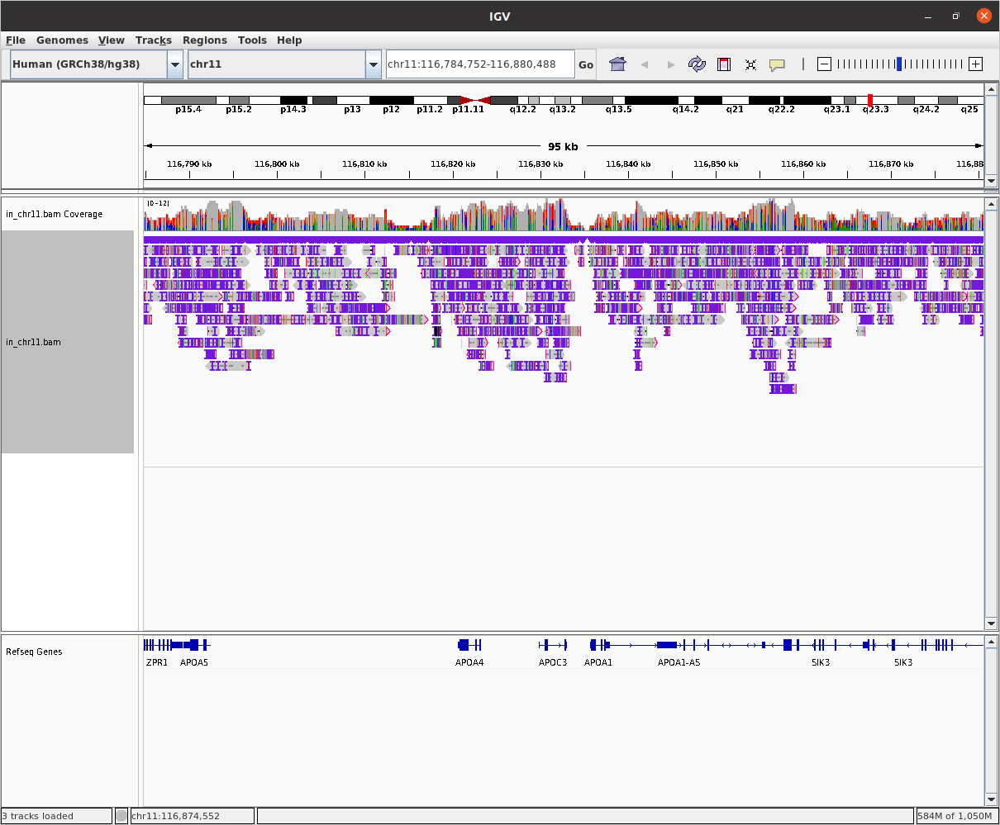

4/22
# Testings on GOD's MinION data
## Raw data 

#### Run 1   
**Date:** 6/24/2021    
**Yield:** 7.31 Gb in 1d 2h 11min   
**Flow Cell type:** FLO-MIN106  
**Kit:** SQK-LSK109  

#### Run 2  
**Date:** 7/1/2021   
**Yield:** 8.34 Gb in 2d 1h 6min   
**Flow Cell type:** FLO-MIN106  
**Kit:** SQK-LSK109  

## 1. Basecalling 
### tool: `Guppy 5.1.15`
## 2. Alignment 
**Reference genome:** hg38

### - `minimap2 2.24-r1122`
#### Statistics summary from the alignment

| name                                    | mean   | q10    | q50    | q90     |
|-----------------------------------------|--------|--------|--------|---------|
| total error contained within alignments | 8.718% | 2.838% | 6.307% | 17.395% |
| substitution                            | 2.843% | 0.712% | 1.901% | 6.522%  |
| deletion                                | 3.972% | 1.054% | 2.503% | 7.147%  |
| insertion                               | 2.208% | 0.583% | 1.585% | 5.219%  |

### - `LRA 1.3.2`
#### Statistics summary from the alignment

| name                                    | mean   | q10    | q50    | q90     |
|-----------------------------------------|--------|--------|--------|---------|
| total error contained within alignments | 8.369% | 2.871% | 6.166% | 16.104% |
| substitution                            | 2.066% | 0.562% | 1.448% | 4.597%  |
| deletion                                | 4.145% | 1.210% | 2.723% | 7.440%  |
| insertion                               | 2.447% | 0.719% | 1.802% | 5.473%  |

## 3. Quality check 
**See quality check report for reads aligned with [minimap2](https://rawcdn.githack.com/ziphra/godsminion/3a8e5829666f9f86cce88747fa23bfe4b4cb8ee5/files/mmiQC.html) and for reads aligned with [lra](https://rawcdn.githack.com/ziphra/godsminion/3a8e5829666f9f86cce88747fa23bfe4b4cb8ee5/files/lraQC.html)**

- **The mean coverage** = 6 with minimap2, which could be expected for 2 MinION runs (see 2016 ONT post ["Human Genome on a MinION"](https://nanoporetech.com/about-us/news/human-genome-minion) However, steady developments in flow cell chemistry, library preparation, and base calling algorithms have seen reported sequencing yields increase from less than 3 GB to greater than 40 GB, allowing a 10x read depth from a single flowcell. 

- **Read length** Seems a little short, even if similar read length from MinION sequencing were reported in the literature ([Lamb *et al.*, 2021](https://doi.org/10.1371/journal.pone.0261274)). We would usually expect a mean read length ranging from 8 to 20kb ([Leung *et al.*, 2022](https://www.nature.com/articles/s41598-022-08576-4)). For structural variants detection, 20kb read length and longer allow for accurate and sensitive SVs detection ([Jiang *et al.*, 2021](https://doi.org/10.1186/s12859‐021‐04422‐y)).

## 4. SNP calling 
### with Pepper Margin Deep Variant
Even though [Lamb *et al.*, 2021](https://doi.org/10.1371/journal.pone.0261274) suggest that ONT’s MinION sequencing at low coverage could be a useful tool for in-situ genomic prediction, with such lousy quality scores, SNP cannot be recalled with confidence. 

**See [PMDV report](https://github.com/ziphra/godsminion/blob/main/files/god_pmdv.visual_report.html.pdf)**

## 5. Structural variant calling
#### With Sniffles and CuteSV
Structural variant calling might be challenging due to low read coverage and not so long read length. 
A table summarizing parameters that can be adjusted can be found [here](./files/cutesnif.pdf). Parameters that can be adjusted to troubleshot low X and smaller reads are shown in red. 

## Microarray results and hypothese
What we were looking for:    

- **duplication**    chr11:116825102-116913660
- **deletion**    chr11:33856203-33877519

**Hypothesis:** duplication in APOC3 chr11:116829907-116833072

### igv 

> Screenshot of igv display over APOC3, from minimap2 alignment. 

Coverage is too heterogeneous to conclude.

